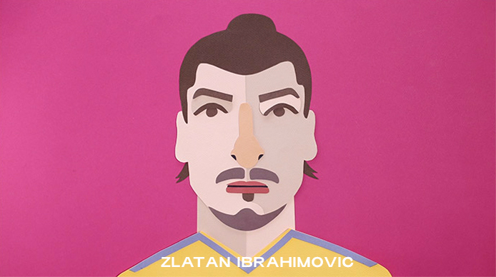
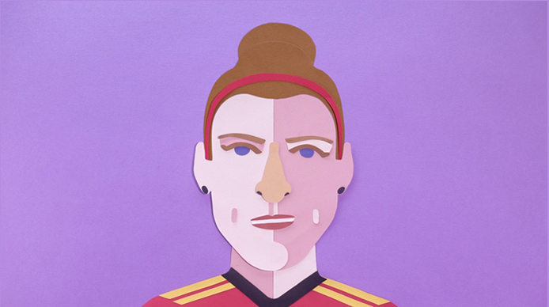

<!DOCTYPE html>
<html lang="fr">

  <head>

    <meta charset="utf-8">
    <meta name="viewport" content="width=device-width, initial-scale=1, shrink-to-fit=no">
    <meta name="description" content="">
    <meta name="author" content="">

    <title>Stylish Portfolio - Start Bootstrap Template</title>

    <!-- Bootstrap Core CSS -->
    <link href="vendor/bootstrap/css/bootstrap.min.css" rel="stylesheet">

    <!-- Custom Fonts -->
    <link href="vendor/font-awesome/css/font-awesome.min.css" rel="stylesheet" type="text/css">
    <link href="https://fonts.googleapis.com/css?family=Source+Sans+Pro:300,400,700,300italic,400italic,700italic" rel="stylesheet" type="text/css">
    <link href="vendor/simple-line-icons/css/simple-line-icons.css" rel="stylesheet">

    <!-- Custom CSS -->
    <link href="css/stylish-portfolio.css" rel="stylesheet">
    <link href="css/stylish_modified.css" rel="stylesheet">

  </head>

  <body id="page-top">
    <!-- Navigation -->
    <a class="menu-toggle rounded" href="#">
      <i class="fa fa-bars"></i>
    </a>
    <nav id="sidebar-wrapper">
      <ul class="sidebar-nav">
        <li class="sidebar-brand">
          <a class="js-scroll-trigger" href="#page-top">Start Bootstrap</a>
        </li>
        <li class="sidebar-nav-item">
          <a class="js-scroll-trigger" href="#page-top">Home</a>
        </li>
        <li class="sidebar-nav-item">
          <a class="js-scroll-trigger" href="#about">About</a>
        </li>
        <li class="sidebar-nav-item">
          <a class="js-scroll-trigger" href="#services">Services</a>
        </li>
        <li class="sidebar-nav-item">
          <a class="js-scroll-trigger" href="#portfolio">Portfolio</a>
        </li>
        <li class="sidebar-nav-item">
          <a class="js-scroll-trigger" href="#contact">Contact</a>
        </li>
      </ul>
    </nav>

    <!-- Header -->
    <header class="masthead">
      

        <h1 class="mb-1 text-wrapper">
          Allon'z enfants de la balle
        </h1>
      

      
      <!---->

      

        
      

    </header>

    <!-- Portfolio -->
    <section class="content-section" id="portfolio">
      

        

          <h3 class="text-secondary mb-0">LE KIT PÉDAGOGIQUE</h3>
          <h2 class="mb-5">LE KIT PÉDAGOGIQUE</h2>
        

        

          

            <a class="portfolio-item" href="#">
              
                
                  <h2>Stationary</h2>
                  
A yellow pencil with envelopes on a clean, blue backdrop!

                
              
              
            </a>
          

          

            <a class="portfolio-item" href="#">
              
                
                  <h2>Ice Cream</h2>
                  
A dark blue background with a colored pencil, a clip, and a tiny ice cream cone!

                
              
              
            </a>
          

          

            <a class="portfolio-item" href="#">
              
                
                  <h2>Strawberries</h2>
                  
Strawberries are such a tasty snack, especially with a little sugar on top!

                
              
              
            </a>
          

          

            <a class="portfolio-item" href="#">
              
                
                  <h2>Workspace</h2>
                  
A yellow workspace with some scissors, pencils, and other objects.

                
              
              
            </a>
          

          

            <a class="portfolio-item" href="#">
              
                
                  <h2>Workspace</h2>
                  
A yellow workspace with some scissors, pencils, and other objects.

                
              
              
            </a>
          

          

            <a class="portfolio-item" href="#">
              
                
                  <h2>Workspace</h2>
                  
A yellow workspace with some scissors, pencils, and other objects.

                
              
              
            </a>
          

        

      

    </section>

    <!-- About -->
    <section class="content-section bg-light" id="about">
      

        

          

            <h2>Stylish Portfolio is the perfect theme for your next project!</h2>
            
This theme features a flexible, UX friendly sidebar menu and stock photos from our friends at
              <a href="https://unsplash.com/">Unsplash</a>!

            <a class="btn btn-dark btn-xl js-scroll-trigger" href="#services">Télécharger le kit</a>
          

        

      

    </section>

    <!-- Services -->
    <section class="content-section bg-primary text-white text-center" id="services">
      

        

          <h3 class="text-secondary mb-0">LES CONTRIBUTEURS</h3>
        

        

          

             
          

          

             
          

          

             
          

          

            
              <i class="icon-mustache"></i>
            
            <h4>
              <strong>Question</strong>
            </h4>
            
I mustache you a question...

          

        

      

    </section>

    <!-- Footer -->
    <footer class="footer text-center">
      

        
Copyright &copy; Your Website 2017

      

    </footer>

    <!-- Scroll to Top Button-->
    <a class="scroll-to-top rounded js-scroll-trigger" href="#page-top">
      <i class="fa fa-angle-up"></i>
    </a>

    <!-- Bootstrap core JavaScript -->
    
    

    <!-- Plugin JavaScript -->
    
    
    

    <!-- Custom scripts for this template -->
    
    

  </body>

</html>
